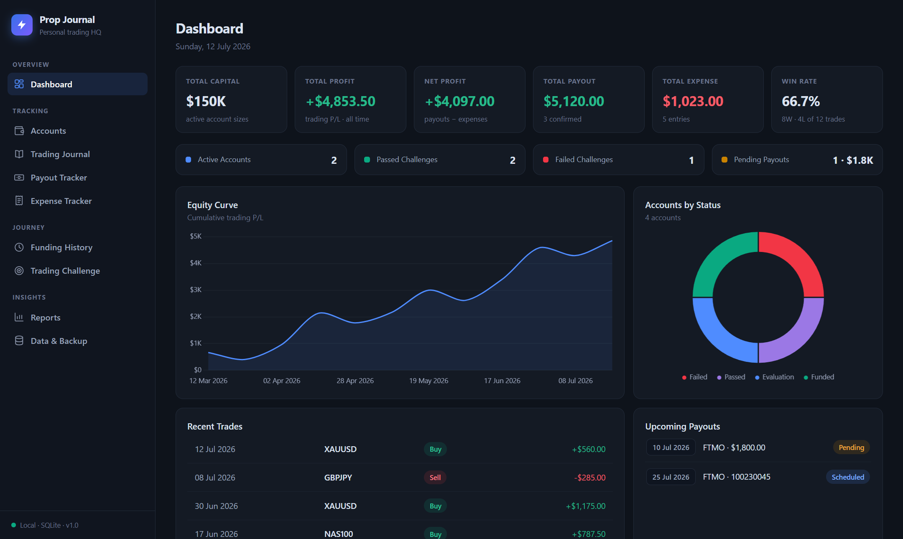
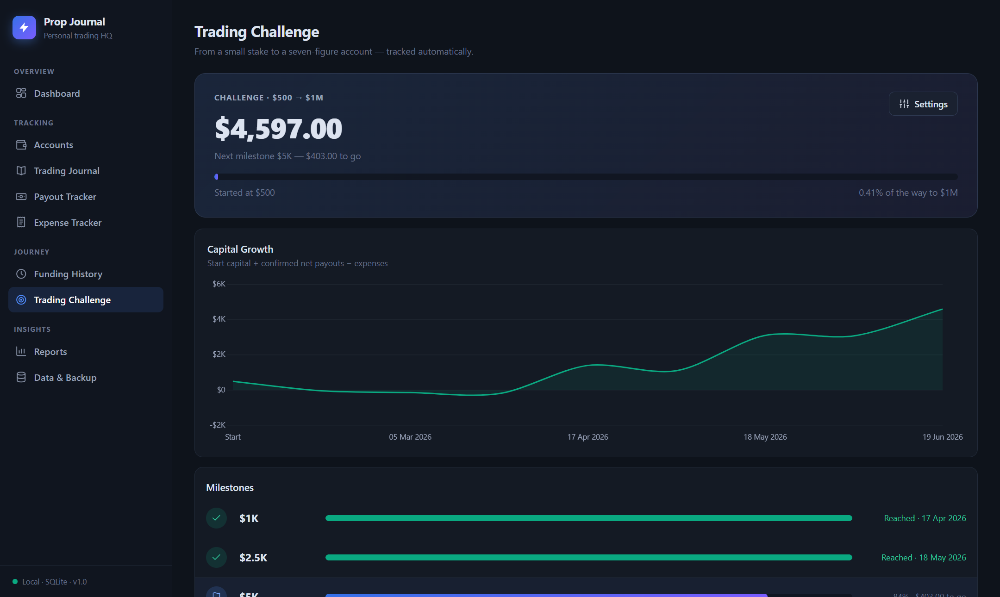
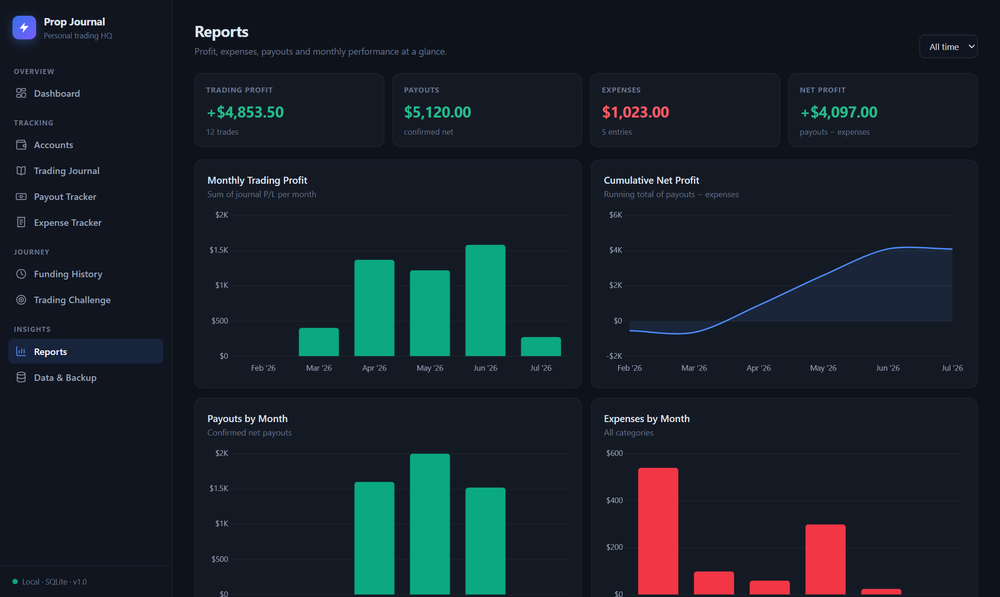

# ⚡ Prop Journal

Personal prop-firm trading journal & dashboard — single user, fully local, no login.
Dark theme inspired by Notion × TradingView. Data lives in a SQLite file on your PC.



| Trading Challenge ($500 → $1M) | Reports |
|---|---|
|  |  |

## Cara menjalankan

Butuh [Node.js](https://nodejs.org) (versi 20 ke atas).

```
git clone https://github.com/Skyrooth/Prop-firm-Journal-V1.git
cd Prop-firm-Journal-V1
npm install
npm start
```

lalu buka **http://localhost:5599**.

Di Windows, setelah `npm install` sekali, selanjutnya cukup double-click `start-prop-journal.bat` — server nyala dan browser terbuka otomatis.

Mau buka dari HP? Pastikan HP satu Wi-Fi dengan PC, lalu buka alamat yang tertera di jendela server (`From your phone (same Wi-Fi): http://...`).

## Halaman

| Halaman | Isi |
|---|---|
| **Dashboard** | Total Capital, Total/Net Profit, Expense, Payout, Win Rate, akun aktif/passed/failed, pending payout, equity curve, breakdown akun |
| **Accounts** | Semua akun prop firm: firm, ID, size, balance, status, funding date, profit, drawdown, next payout, notes |
| **Trading Journal** | Log trade (arah, lot, entry/exit, P/L, screenshot, notes) + profit harian/mingguan/bulanan & win rate otomatis |
| **Payout Tracker** | Payout per akun: tanggal, amount, status, sertifikat, tanggal konfirmasi, net payout |
| **Expense Tracker** | Biaya challenge/reset/tools per kategori |
| **Funding History** | Setiap akun funded + riwayat payout-nya |
| **Trading Challenge** | Perjalanan $500 → $1,000,000 — milestone selesai otomatis begitu capital menyentuhnya |
| **Reports** | Chart bulanan: trading profit, cumulative net, payout, expense, kategori, win rate, monthly performance |
| **Data & Backup** | Export/Import Excel, backup/restore JSON, clear all |

## Definisi angka (biar konsisten)

- **Total Capital** = jumlah account size akun berstatus *Evaluation* + *Funded*.
- **Total Profit** = jumlah P/L semua trade di journal.
- **Total Payout** = jumlah **net payout** berstatus *Confirmed* (kalau net kosong, dipakai amount).
- **Net Profit** = Total Payout − Total Expense (uang beneran di kantong).
- **Passed Challenges** = akun berstatus *Passed* atau *Funded*.
- **Challenge capital** = start capital ($500, bisa diubah di Settings) + payout confirmed − expenses. Milestone tercapai otomatis lengkap dengan tanggalnya.

## Data & backup

- Database: `data/prop-journal.db` (SQLite). Screenshot & sertifikat ikut tersimpan di dalamnya.
- **Backup JSON** (Data & Backup → Download backup) = snapshot lengkap termasuk gambar — simpan rutin.
- **Excel** cocok untuk analisis/edit massal; sheet-nya (`Accounts`, `Trades`, `Payouts`, `Expenses`) bisa di-import balik (menambah baris, tidak menghapus).
- Restore JSON **mengganti seluruh data** — selalu backup dulu.

## Teknis

- Node.js + Express + better-sqlite3 (server), vanilla JS + Chart.js (UI), SheetJS untuk Excel.
- Semua library disajikan lokal dari `node_modules` — jalan tanpa internet.
- Port default `5599` (ubah lewat env `PORT`).
